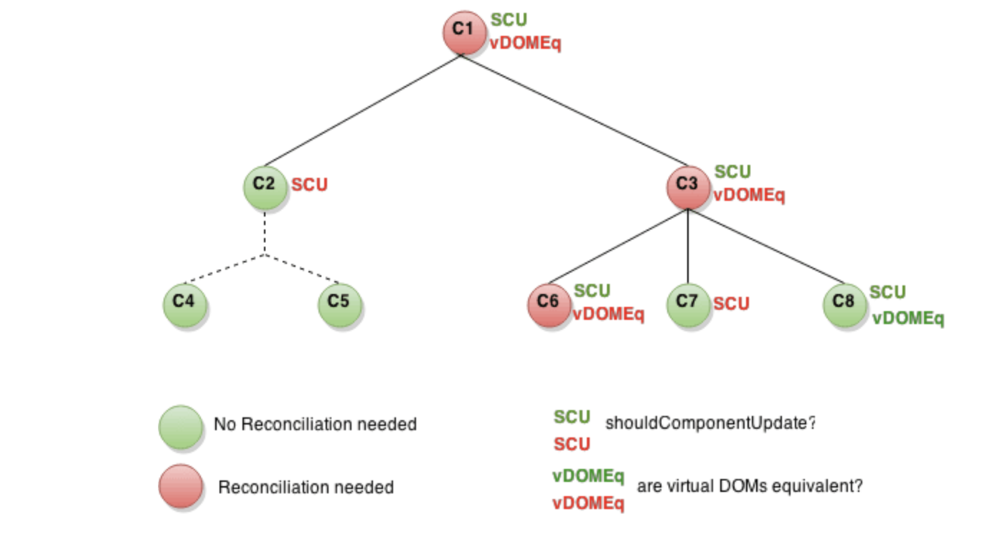

## shouldComponentUpdate 的作用

这是一个组件的子树。每个节点中，`SCU` 代表 `shouldComponentUpdate` 返回的值，而 `vDOMEq` 代表返回的 React 元素是否相同。最后，圆圈的颜色代表了该组件是否需要被调停。




最后一个有趣的例子是 C8。React 需要渲染这个组件，但是由于其返回的 React 元素和之前渲染的相同，所以不需要更新 DOM。

显而易见，你看到 React 只改变了 C6 的 DOM。对于 C8，通过对比了渲染的 React 元素跳过了渲染。而对于 C2 的子节点和 C7，由于 `shouldComponentUpdate` 使得 `render` 并没有被调用。因此它们也不需要对比元素了。

## 示例

如果你的组件只有当 `props.color` 或者 `state.count` 的值改变才需要更新时，你可以使用 `shouldComponentUpdate` 来进行检查：

```javascript
class CounterButton extends React.Component {
  constructor(props) {
    super(props);
    this.state = {count: 1};
  }

  shouldComponentUpdate(nextProps, nextState) {
    if (this.props.color !== nextProps.color) {
      return true;
    }
    if (this.state.count !== nextState.count) {
      return true;
    }
    return false;
  }

  render() {
    return (
      <button
        color={this.props.color}
        onClick={() => this.setState(state => ({count: state.count + 1}))}>
        Count: {this.state.count}
      </button>
    );
  }
}
```

在这段代码中，`shouldComponentUpdate` 仅检查了 `props.color` 或 `state.count` 是否改变。如果这些值没有改变，那么这个组件不会更新。如果你的组件更复杂一些，你可以使用类似“浅比较”的模式来检查 `props` 和 `state` 中所有的字段，以此来决定是否组件需要更新。React 已经提供了一位好帮手来帮你实现这种常见的模式 - 你只要继承 `React.PureComponent` 就行了。所以这段代码可以改成以下这种更简洁的形式：

```javascript
class CounterButton extends React.PureComponent {
  constructor(props) {
    super(props);
    this.state = {count: 1};
  }

  render() {
    return (
      <button
        color={this.props.color}
        onClick={() => this.setState(state => ({count: state.count + 1}))}>
        Count: {this.state.count}
      </button>
    );
  }
}
```

大部分情况下，你可以使用 `React.PureComponent` 来代替手写 `shouldComponentUpdate`。但它只进行浅比较，所以当 props 或者 state 某种程度是可变的话，浅比较会有遗漏，那你就不能使用它了。当数据结构很复杂时，情况会变得麻烦。例如，你想要一个 `ListOfWords` 组件来渲染一组用逗号分开的单词。它有一个叫做 `WordAdder` 的父组件，该组件允许你点击一个按钮来添加一个单词到列表中。以下代码*并不*正确：


```javascript
class ListOfWords extends React.PureComponent {
  render() {
    return <div>{this.props.words.join(',')}</div>;
  }
}

class WordAdder extends React.Component {
  constructor(props) {
    super(props);
    this.state = {
      words: ['marklar']
    };
    this.handleClick = this.handleClick.bind(this);
  }

  handleClick() {
    // 这部分代码很糟，而且还有 bug
    const words = this.state.words;
    words.push('marklar');
    this.setState({words: words});
  }

  render() {
    return (
      <div>
        <button onClick={this.handleClick} />
        <ListOfWords words={this.state.words} />
      </div>
    );
  }
}
```

问题在于 `PureComponent` 仅仅会对新老 `this.props.words` 的值进行简单的对比。由于代码中 `WordAdder` 的 `handleClick` 方法改变了同一个 `words` 数组，使得新老 `this.props.words` 比较的其实还是同一个数组。即便实际上数组中的单词已经变了，但是比较结果是相同的。可以看到，即便多了新的单词需要被渲染， `ListOfWords` 却并没有被更新。

#####使用不可变数据

拓展运算符，Object.assign(第一个参数为空())，concat，JSON.parse(JSON.stringify(xxx))，[Immutable.js](https://github.com/facebook/immutable-js) 


> [Immutable.js](https://github.com/facebook/immutable-js) 是另一种解决方案。它通过结构共享提供了不可变、持久化集合：
>
> - *不可变*：一旦创建，一个集合便不能再被修改。
> - *持久化*：对集合进行修改，会创建一个新的集合。之前的集合仍然有效。
> - *结构共享*：新的集合会尽可能复用之前集合的结构，以最小化拷贝操作来提高性能。


不可变数据使得追踪变更非常容易。每次变更都会生成一个新的对象使得我们只需要检查对象的引用是否改变。举个例子，这是一段很常见的 JavaScript 代码：

```
const x = { foo: 'bar' };
const y = x;
y.foo = 'baz';
x === y; // true
```

由于 `y` 被指向和 `x` 相同的对象，虽然我们修改了 `y`，但是对比结果还是 `true`。你可以使用 immutable.js 来写相似的代码：

```
const SomeRecord = Immutable.Record({ foo: null });
const x = new SomeRecord({ foo: 'bar' });
const y = x.set('foo', 'baz');
const z = x.set('foo', 'bar');
x === y; // false
x === z; // true
```

在这个例子中，修改 `x` 后我们得到了一个新的引用，我们可以通过判断引用 `(x === y)` 来验证 `y` 中存的值和原本 `x` 中存的值不同。

