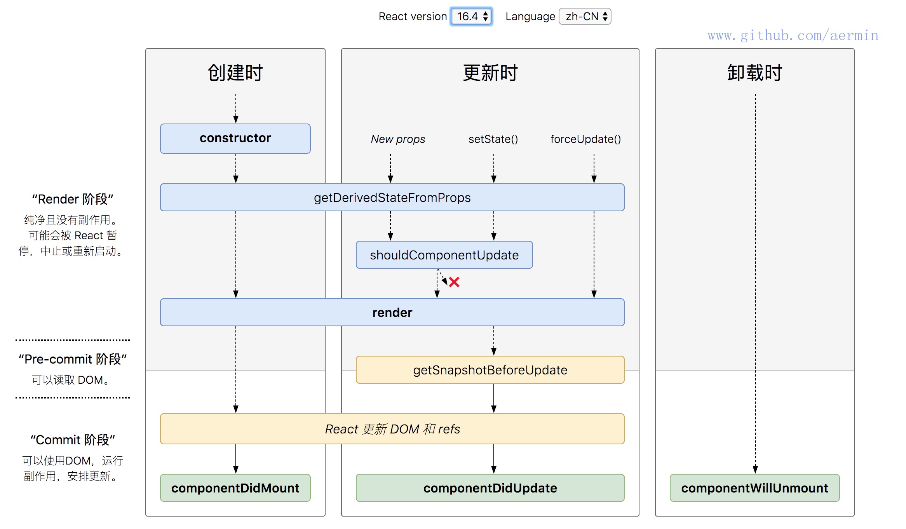
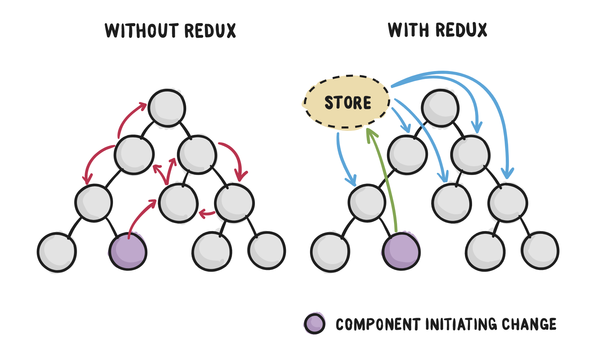
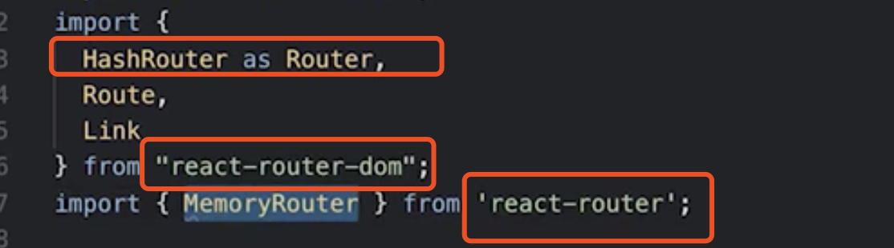

### jsx

##### 什么是jsx

JSX是JavaScript XML,是React提供的语法糖, 能让我们可以在JS中写html标记语言。

##### 一般写法

```jsx
<h1>Hello, {getName(props)}</h1>
```

##### jsx实际做了什么

首先怎么才能写JSX呢，在普通的JS文件中需引入react,reactDOM(若要对DOM进行操作)以及babel

Babel 会把 JSX 转译成一个名为 `React.createElement()` 函数调用：

```jsx
const element = (
  <h1 className="greeting">
    Hello, world!
  </h1>
);

//Babel输出
const element = React.createElement(
  'h1',
  {className: 'greeting'},
  'Hello, world!'
);

```

`React.createElement()` 会预先执行一些检查，以帮助你编写无错代码，但实际上它创建了一个这样的对象：

```jsx
// 注意：这是简化过的结构
const element = {
  type: 'h1',
  props: {
    className: 'greeting',
    children: 'Hello, world!'
  }
};
```

这些对象被称为 “React 元素”。它们描述了你希望在屏幕上看到的内容。React 通过读取这些对象，然后使用它们来构建 DOM 以及保持随时更新。

##### JSX 防止注入攻击

你可以安全地在 JSX 当中插入用户输入内容：

```jsx
const title = response.potentiallyMaliciousInput;
// 直接使用是安全的：
const element = <h1>{title}</h1>;
```

React DOM 在渲染所有输入内容之前，默认会进行[转义](https://stackoverflow.com/questions/7381974/which-characters-need-to-be-escaped-on-html)。它可以确保在你的应用中，永远不会注入那些并非自己明确编写的内容。所有的内容在渲染之前都被转换成了字符串。这样可以有效地防止 [XSS（cross-site-scripting, 跨站脚本）](https://en.wikipedia.org/wiki/Cross-site_scripting)攻击。

##### 用jsx的优点

> 可以利用JavaScript本身的语法，不用再去学习新的模版语言，它是换了一种写法的JavaScript，可以利用到JavaScript本身的语法（核心是表达式）。

1. jsx本身也是表达式
2. 在属性中使用表达式
3. 延展属性`const props = {fristName: 'aaa', lastName: 'bbb'}; const greeting = <Greeting {...props}>`
4. 表达式作为子元素


### 组件

##### 单一职责原则

1. 每个组件只做一件事
2. 如果组件变得复杂就拆分小组件（优化的时候，状态变化，小组件状态没有改变，可以不用刷新）

##### DRY原则

1. 能计算得到的状态就不要单独存储
2. 组件尽量无状态，所需数据通过props获取（更容易被重用）

##### 受控组件

**表单元素状态由使用者维护(来自外部)**，使 React 的 state 成为“唯一数据源”。渲染表单的 React 组件还控制着用户输入过程中表单发生的操作。被 React 以这种方式控制取值的表单输入元素就叫做“受控组件”。即是：

1. 设置value
2. onChange

##### 非受控组件

**单元素状态DOM自身维护**，不是为每个状态更新都编写数据处理函数，你可以 [使用 ref](https://zh-hans.reactjs.org/docs/refs-and-the-dom.html) 来从 DOM 节点中获取表单数据。

### 生命周期



##### construct

- 用于初始化内部状态，比较少使用（因为可能在其他生命周期处理）
- 唯一可以直接修改state的地方

##### getDerivedStatsFromProps

从属性初始化内部状态

1. 当state需要从props初始化时调用
2. 尽量不要使用：维护两者状态一致会增加复杂度
3. 没次render都会调用
4. 典型场景，表单控件获取默认值

大部分使用派生 state 导致的问题，不外乎两个原因：

1. 直接复制 props 到 state 上
2. 如果 props 和 state 不一致就更新 state

建议的模式：

1. 采用完全可控的组件
2. 有key的非可控组件

```react
 <UncontrolledEmailInput
          key={selectedAccount.id}
          defaultEmail={selectedAccount.email}
        />

export default class UncontrolledEmailInput extends Component {
  // Default the "draft" email to the value passed in via props.
  state = {
    email: this.props.defaultEmail
  };

  handleChange = event => {
    this.setState({ email: event.target.value });
  };

  render() {
    return (
      <label>
        Email: <input onChange={this.handleChange} value={this.state.email} />
      </label>
    );
  }
}

```

##### componentDidMount

适合只做唯一一次获取外部资源

1. UI渲染完成后调用
2. **只执行一次**
3. 典型场景：获取外部资源

##### componentWillUnmount

1. 组件被移除时调用
2. 典型场景：资源释放

#####getSnapshotBeforeUpdate

替代[`componentWillReceiveProps`](<https://zh-hans.reactjs.org/blog/2018/06/07/you-probably-dont-need-derived-state.html#when-to-use-derived-state>)

1. 在页面render之前调用，state已更新
2. 典型场景：获取render之前的dom状态

#####componentDidUpdate

1. 每次UI更新时调用
2. 典型场景：页面需要根据props变化重新获取数据

##### shouldComponentUpdate

1. Virual DOM是否需要重绘
2. 一般可以有PureComponent自动实现
3. 典型场景：性能优化

> 大部分情况下，你可以使用 [`React.PureComponent`](/Users/jaclin/jaclin/webNote/react/Component & PureComponent.md) 来代替手写 `shouldComponentUpdate`。但它只进行浅比较，所以当 props 或者 state 某种程度是可变的话，浅比较会有遗漏，那你就不能使用它了。

> 问题在于 `PureComponent` 仅仅会对新老 `this.props.words`的值进行简单的对比。代码中 `handleClick` 方法改变了同一个数组，使得新老 `this.props.words` 比较的其实还是同一个数组。即便实际上数组中的单词已经变了，但是比较结果是相同的。可以看到，即便多了新的单词需要被渲染， `ListOfWords` 却并没有被更新。这时候可以使用**不可变数据**或[Immutable.js](https://github.com/facebook/immutable-js) 

###Virtual Dom（JSX运行的基础）

##### 虚拟DOM如何工作

1. 广度优先分层比较
2. 同类节点交换位置（用节点的key标识）
3. 节点移动到新的父节点，多出的节点直接删掉，少的节点直接添加

正常情况下两个树之间的区别是算法是O(N^3)：传统Diff算法需要找到两个树的最小更新方式，所以需要[两两]对比每个叶子节点是否相同，对比就需要O(n^2)次了，找到差异后还要计算最小转换方式，最终结果为O(n^3)。

react的diff算法：

```javascript
[0,0]     :     PA->LA   # 相同，不理会
[0.0, 0.0]:     PB->LD   # 不同，删除PB，添加LD
[0.1, 0.1]:     PD->LB   # 不同，更新
[0.1.0, 0.1.0]: PC->Null # Last树没有该节点，所以删除PC即可
[0.1.2, 0.1.2]: Null->LC # Prev树没有该节点，所以添加C到该位置
```

标准的O(n)，所有的节点只遍历一次。

React认为：一个ReactElement的type不同，那么内容基本不会复用，所以直接删除节点，添加新节点，这是一个非常大的优化，大大减少了对比时间复杂度。

##### 虚拟dom的两个假设

1. 组件的DOM结构相当稳定(直接删除节点的影响小)
2. 类型相同的兄弟节点可以被唯一标识(key)

### 组件复用

高阶组件和函数子组件都是设计模式

##### 高阶组件

高阶组件作为参数，对已有组件进行封装，形成新组件，新组件会有一些自己的逻辑，逻辑会通过属性传给原有组件。高阶组件一般不会有自己的UI展现，只是为它封装的组件提供一些额外的功能。

适用场景：

1. 组件属性通过隔了几层的父组件传给它，通过高阶函数就不需要一层层往下传。（这时候属性可能有两个来源，一个来自父组件，一个来自高阶函数）
2. 用到refs的时候

实例：

```jsx
export default function withTimer(WrappedComponent) {
  return class extends React.Component {
    state = { time: new Date() };
    componentDidMount() {
      this.timerID = setInterval(() => this.tick(), 1000);
    }
    componentWillUnmount() {
      clearInterval(this.timerID);
    }
    tick() {
      this.setState({
        time: new Date()
      });
    }
    render() {
      return <WrappedComponent time={this.state.time} {...this.props} />;
    }
  };
}


export class ChatApp extends React.Component {
  // ....
  render() {
    return (
      // ...
   		<h2>{this.props.time.toLocaleString()}</h2>
    )
  }
}

export default withTimer(ChatApp);

```


#####函数作为子组件

实例：

```jsx
import React, { PureComponent } from "react";
import PropTypes from "prop-types";

export default class AdvancedTabSelector extends PureComponent {
  static propTypes = {
    value: PropTypes.object,
    options: PropTypes.array,
    onChange: PropTypes.func,
    children: PropTypes.func
  };

  static defaultProps = {
    value: null,
    options: [],
    onChange: () => {},
    children: () => {}
  };

  render() {
    const { options, value, onChange } = this.props;
    return (
      <div className="tab-selector">
        <ul>
          {options.map(opt => (
            <li
              key={opt.value}
              className={`tab-item ${
                opt.value === this.props.value ? "selected" : ""
              }`}
              onClick={() => this.props.onChange(opt.value)}
            >
              {opt.name}
            </li>
          ))}
        </ul>
        <br />
        <br />
        {this.props.value && this.props.children(this.props.value)}
      </div>
    );
  }
}

const colors = [
  { name: "Red", value: "red" },
  { name: "Blue", value: "blue" },
  { name: "Orange", value: "orange" }
];

const animals = [
  { name: "Tiger", value: "tiger" },
  { name: "Elephant", value: "elephant" },
  { name: "Cow", value: "cow" }
];

export class AdvancedTabSelectorSample extends PureComponent {
  state = {
    color: null
  };
  render() {
    return (
      <div>
        <h3>Select color: </h3>
        <AdvancedTabSelector
          options={colors}
          value={this.state.color}
          onChange={c => this.setState({ color: c })}
        >
          {color => (
            <span
              style={{
                display: "inline-block",
                backgroundColor: color,
                width: "40px",
                height: "40px"
              }}
            />
          )}
        </AdvancedTabSelector>
        <br />
        <br />
        <br />
        <h3>Select animal: </h3>
        <AdvancedTabSelector
          options={animals}
          value={this.state.animal}
          onChange={c => this.setState({ animal: c })}
        >
          {animal => (
            
          )}
        </AdvancedTabSelector>
      </div>
    );
  }
}

```

### Context API

为什么不放外部自己的object而是用context，因为用外部object要自己监听

用到了函数作为子组件的设计模式

注意： **子组件必须放在provider的层级下面，如果放在provider外面只能拿到默认值**

实例

```jsx
import React from "react";

const enStrings = {
  submit: "Submit",
  cancel: "Cancel"
};

const cnStrings = {
  submit: "提交",
  cancel: "取消"
};
const LocaleContext = React.createContext(enStrings);

class LocaleProvider extends React.Component {
  state = { locale: cnStrings };
  toggleLocale = () => {
    const locale =
      this.state.locale === enStrings
        ? cnStrings
        : enStrings;
    this.setState({ locale });
  };
  render() {
    return (
      <LocaleContext.Provider value={this.state.locale}>
        <button onClick={this.toggleLocale}>
          切换语言
        </button>
        {this.props.children}
      </LocaleContext.Provider>
    );
  }
}

class LocaledButtons extends React.Component {
  render() {
    return (
      <LocaleContext.Consumer>
        {locale => (
          <div>
            <button>{locale.cancel}</button>
            &nbsp;<button>{locale.submit}</button>
          </div>
        )}
      </LocaleContext.Consumer>
    );
  }
}

export default () => (
  <div>
    <LocaleProvider>
      <div>
        <br />
        <LocaledButtons />
      </div>
    </LocaleProvider>
    <LocaledButtons />
  </div>
);

```


### Redux



### React Router

##### 为什么需要路由

1. 单页应用需要进行页面切换
2. 通过URL可以定位到页面
3. 更有语义到组织资源（每个页面都是高内聚，松耦合）

##### 路由的特性

1. 声明式路由定义（可以像使用react标记一样做为tag定义的，使用灵活）
2. 动态路由（路由在页面render的时候才实时解析的）

##### 三种实现方式

1. url路径（BrowserRouter）
2. hash路由（HashRouter带#，兼容低版本浏览器）
3. 内存路由（MemoryRouter 路由状态存在内存里面，不会反应到url上，url不会发生变化，一般是用于服务器的渲染）



##### 基于路由配置进行资源组织

1. 实现业务逻辑的松耦合 （会把页面相关的部分组织在一起，无论是业务上的逻辑还是代码）
2. 易于拓展，重构和维护 （没有把所有的路由都放到业务逻辑中，而是抽象出来通过react-router实现路由配置）
3. 路由层面实现Lazy Load

##### React Router API

1. Link: 普通链接，不会促发浏览器刷新
2. NavLink: 类似Link但会添加当前选中状态（可以有一个class叫 activeClassName="xxx"）
3. Prompt：满足条件时提示用户是否离开当前页面 （两个属性： when什么时候提示 message提示）
4. Redirect: 重定向当前页面，例如登录判断
5. Route：路由配置的核心标记，路径匹配时显示对应组件
6. Switch：只显示第一个匹配的路由器

##### 通过url传参数

1. 通过url传参数`<Route path="/topic/:id" component={Topic} />`
2. 获取参数：this.props.match.params
3. [通过正则表达式](<https://github.com/pillarjs/path-to-regexp>)

```jsx
const Topic = ({ match }) => (
  <h1>Topic {match.params.id}</h1>
);

// 比较推荐的做法,参数作为路径的一部分,而不是作为查询字符串
<li>
  <Link to="/topic/1">Topic 1</Link>
</li>
<li>
  <Link to="/topic/2">Topic 2</Link>
</li>

<Route path="/topic/:id" component={Topic} />
```

**页面状态尽量通过url参数定义**，比如筛选那些，因为可能刷新，也可能从其他页面跳转过来，跳转过来需要定位到某个日期或者某个用户等。

**url发生变化组件会刷新，和state发生变化组件刷新一样**

##### 嵌套路由


###同构应用

#####同构应用的概念

web应用分为浏览器端和服务器端。同构应用分为初次发送请求和后续发送请求，对于第一次发送的请求，由服务器端端完成页面渲染，包括html和css，返回给浏览器直接显示，第一次打开页面浏览器不需要进行js的操作，所以比较快。后续的浏览器端操作像单页应用一样，不需要浏览器的刷新，路由什么由前端完成。

##### 同构与spa对比

**SPA**：

1. 客户端请求页面，服务端返回SPA的html，此html不可视；（request&response）
2. html加载完之后，去加载页面中的js；（processing）
3. js加载完成之后开始执行；（rendering）
4. 页面首次渲染完毕，向后端请求数据（loading）
5. 请求返回，页面再次渲染，用户可交互（useing）

**SSR**：

1. 客户端请求页面，服务端去请求数据，请求返回后渲染页面，将渲染好的html返回给客户端，此时页面可视；（request&response）
2. html加载完之后，去加载页面中的js；（processing）
3. js加载完成之后开始执行；（rendering）
4. js解析完毕，用户可交互；（useing）

通过上述流程图可发现，理论上同构要比客户端渲染要快，而且体验要好。

##### Next.js

提供很多便利的机制可以方便用react开发同构应用，免去webpeack搭配同构应用的麻烦。


```javascript

```

