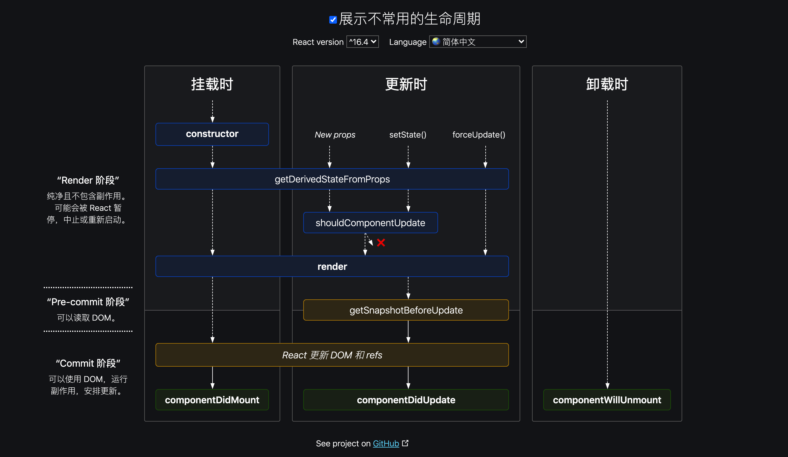

#####componentWillReceiveProps /getDerivedStateFromProps对比

在初始化组件数据时, 我们有时需要将组件接收的参数 props 中的数据添加到它的 state 中, 期望组件响应 props 的变化。

然而组件接收的 props 数据是只读的, 不可变的, 禁止修改的。 当组件接收了新的 props 时, constructor 函数中数据初始化行为并不会再次发生. 于是我们想要在 componentWillReceiveProps / getDerivedStateFromProps 生命周期函数中获取新的 props 并且调用 setState() 来更新数据。

例如，编辑界面需要进行表单数据回填，父组件异步获取数据，然后传给子组件，子组件拿到数据后放入state，然后用value属性来展示。子组件要拿到这个异步数据就要使用到`componentWillReceiveProps`。

**`UNSAFE_componentWillReceiveProps(nextProps)`**在组件接收到新的参数时被触发。当父组件导致子组件更新的时候, 即使接收的 props 并没有变化, 这个函数也会被调用。

**当外部多个属性在很短的时间间隔之内多次变化，就会导致componentWillReceiveProps被多次调用。这个调用并不会被合并，如果这次内容都会触发异步请求，那么可能会导致多个异步请求阻塞。**


**`getDerivedStateFromProps(props, state)`**会在每次组件渲染前被调用。会在每次组件被重新渲染前被调用, 这意味着无论是父组件的更新, props 的变化, 或是组件内部执行了 setState(), 它都会被调用。

这个生命周期函数会在每次调用render之前被触发，reactsetState操作是会通过transaction进行合并的，由此导致的更新过程是batch的，而react中大部分的更新过程的触发源都是setState，所以render触发的频率并不会非常频。

在使用getDerivedStateFromProps的时候，遇到了上面说的props在很短的时间内多次变化，也只会触发一次render，也就是只触发一次getDerivedStateFromProps。这样的优点不言而喻。

使用getDerivedStateFromProps进行异步的处理：

```javascript
// 在getDerivedStateFromProps中进行state的改变
static getDerivedStateFromProps(nextProps, prevState) {
    if (nextProps.type !== prevState.type) {
        return {
            type: nextProps.type,
        };
    }
    return null;
}
// 在componentDidUpdate中进行异步操作，驱动数据的变化
componentDidUpdate() {
    this._loadAsyncData({...this.state});
}
```