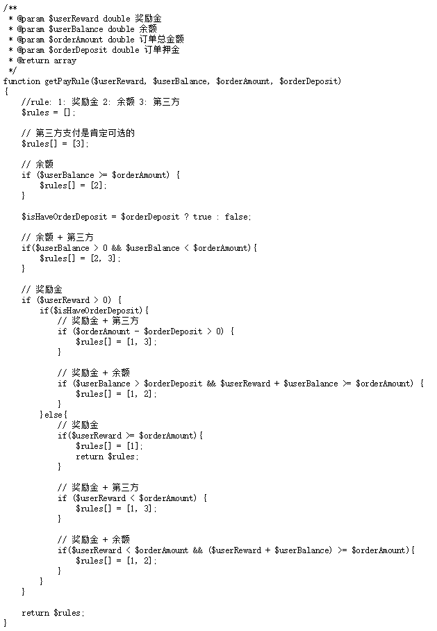

如果是美团红包呢

#####每次都判断用户勾选了： 

​	余额

```javascript
if（有押金）{
    if（余额-押金 > 0）{
        if (余额-押金-物品价值 >= 0) {
            //不用第三方余额就够用了
        } else {
            // 余额只够押金不够加上物品价值
            // 默认勾选第三方付款金额为-（余额-押金-物品价值）
        }
    } else {
        // 余额连押金都不够
        // 默认勾选第三方付款金额为(-(余额-押金)+物品价值)
    }
} else {
    // 无押金的情况
    if (余额-物品价值 > 0) {
       //  余额够支付
    } else {
        // 加上第三方
    }
}
```

​	余额+第三方

```javascript
if(有押金){
   
} else {
    
}
```

​	余额+奖励金

```javascript
// 选中奖励金点时候，需要判断奖励金是不是大于非押金的部分，是的话只扣部分
```

​	第三方

​	

​	第三方+奖励金


​	奖励金


#####改进后：根据用户选中的内容，切换判断的方法，选中的时候先判断之前选了什么

// 是否需要前端判断默认选中的内容,  默认勾选余额>第三方>奖励金

```javascript
// 判断奖励金是否可以选
总额-押金>0为可以选 
```

选中余额的时候

```javascript
// 本来什么都没选，那么现在只有： 余额
if（余额-总金额 >= 0）{
    //不用第三方余额就够用了
} else {
    // 勾选第三方，第三方付款金额为 -(余额-总额)
}

// 如果已经选了第三方，则现在选中的有： 余额+第三方 或者 只有余额
if （余额-总金额 >= 0）{
    // 去掉第三方的勾选，只选余额就够了
} else {
    // 第三方支付金额为 -（余额-总金额）
}

//如果已经选中了奖励金，则现在有： 余额
因为 // 奖励金够用 余额与奖励金互斥
    // 选中余额 取消奖励金


// 如果已经选了第三方 + 奖励金, 则现在有： 余额+奖励金 或 第三方+奖励金 或 余额
// 说明奖励金不够
if（余额+奖励金-总金额 < 0 ）{
    // 余额不够扣
    // 提升您的余额不足
    // 按原来第三方+奖励金
} else if (余额 - 总金额 > 0) {
    //  只勾选余额就够了
} else  {
    // 余额 + 奖励金
}
```

选中第三方的时候  ... ...

选中奖励金的时候 ... ...

