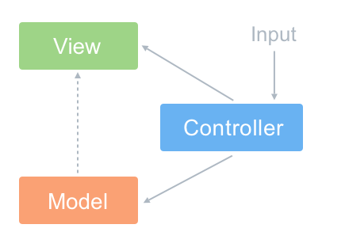
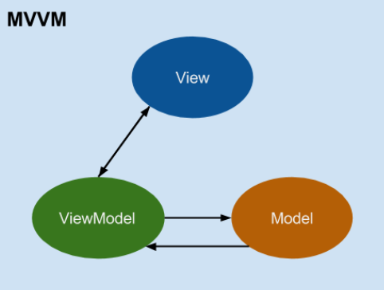

React可以作为MVVM中第二个V，也就是View，但是并不是MVVM框架。

React的组件有自己的state，可以代替MVVM中M（Model）的功能，但是和MVVM完全两码事。

没有双向绑定就不是 MVVM

**MVC**

**MVC的含义**：

- M（modal）：是应用程序中处理数据逻辑的部分。
- V （view）  ：是应用程序中数据显示的部分。
- C（controller）：是应用程序中处理用户交互的地方（`Controller是MVC中的数据和视图的协调者，也就是在Controller里面把Model的数据赋值给View来显示（或者是View接收用户输入的数据然后由Controller把这些数据传给Model来保存到本地或者上传到服务器）`）

**传统的web开发时如何实现MVC模式的**

如果前端没有框架，只使用原生的html+js，MVC模式可以这样理解。将html看成view;js看成controller，负责处理用户与应用的交互，响应对view的操作（对事件的监听），调用Model对数据进行操作，完成model与view的同步（根据model的改变，通过选择器对view进行操作）;将js的ajax当做Model，也就是数据层，通过ajax从服务器获取数据（按照上面这种方式分层，感觉多少有点强行MVC，因为Model层被弱化了）。

**MVC模式有什么缺点**

- 对 DOM 操作的代价非常高
- 程序运行缓慢且效率低下
- 内存浪费严重
- 应用程序复杂性高，难以分工开发
- MVC中的控制器并不能直接更新视图，所以MVC并不能实现视图和模型的完全分离，视图依然依赖模型的数据（数据结构）来显示，也就是说视图依赖模型

**什么是MVVM：**

- M（modal）：模型，定义数据结构。
- C（controller）：实现业务逻辑，数据的增删改查。在MVVM模式中一般把C层算在M层中，（只有在理想的双向绑定模式下，Controller 才会完全的消失。这种理想状态一般不存在）。
- VM（viewModal）：视图View的模型、映射和显示逻辑（如if for等，非业务逻辑），另外绑定器也在此层。ViewModel是基于视图开发的一套模型，如果你的应用是给盲人用的，那么也可以开发一套基于Audio的模型AudioModel。
- V（view） ：将ViewModel通过特定的GUI展示出来，并在GUI控件上绑定视图交互事件，V(iew)一般由MVVM框架自动生成在浏览器中。

**MVVM的优点：**

视图模型和视图实现了双向绑定，当视图发生变化的时候视图模型也会发生改变，当视图模型变化的时候视图也随之变化。

MVVM比MVC精简很多，不仅简化了业务与界面的依赖，还解决了数据频繁更新的问题，不用再用选择器操作DOM元素。因为在MVVM中，View不知道Model的存在，Model和ViewModel也观察不到View，这种低耦合模式提高代码的可重用性

 

**MVVM的双绑和单绑区别：**

- 一般只有UI表单控件才存在双向数据绑定，非UI表单控件只有单向数据绑定。
- 单向数据绑定是指：M的变化可以自动更新到ViewModel，但ViewModel的变化需要手动更新到M（通过给表单控件设置事件监听）
- 双向数据绑定是指念：M的变化可以自动更新到ViewModel，ViewModel的变化也可以自动更新到M
- 双向绑定 = 单向绑定 + UI事件监听。双向和单向只不过是框架封装程度上的差异，本质上两者是可以相互转换的。

优缺点：在表单交互较多的情况下，单向数据绑定的优点是数据更易于跟踪管理和维护，缺点是代码量较多比较啰嗦，双向数据绑定的优缺点和单向绑定正好相反。

**MVVM模式在react中的对应关系**

-  M(odel)：对应组件的方法或生命周期函数中实现的业务逻辑和this.state中保存的本地数据，如果React集成了redux +react-redux，那么组件中的业务逻辑和本地数据可以完全被解耦出来单独存放当做M层，如业务逻辑放在Reducer和Action中。
-  V(iew)-M(odel)：对应组件中的JSX，它实质上是Virtual DOM的语法糖。React负责维护 Virtual DOM以及对其进行diff运算，而React-dom 会把Virtual DOM渲染成浏览器中的真实DOM
-  View：对应框架在浏览器中基于虚拟DOM生成的真实DOM（并不需要我们自己书写）以及我们书写的CSS
- 绑定器：对应JSX中的命令以及绑定的数据，如className={ this.props.xxx }、{this.props.xxx}等等