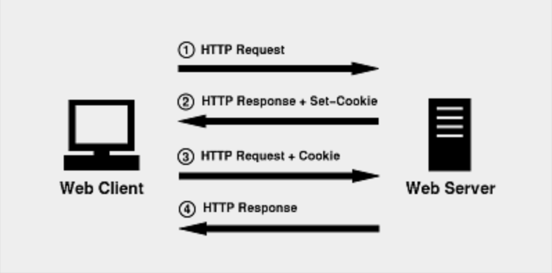

###cookie

#####cookie的传递流程

#####cookie中使用domain

a.b.e.f.com.cn  以下用域名1指代此域名

c.d.e.f.com.cn   以下用域名2指代此域名

在域名中，所有域名进行分级，也就是说域名1与域名2都是f.com.cn（二级域名）的子域名，f.com.cn（一级域名）又是com.cn的子域名

在域名1所使用的服务中，可以设置域名

a.b.e.f.com.cn

b.e.f.com.cn

e.f.com.cn

f.com.cn

设置其他域名虽然可以在响应头中有set-cookie的头，但是出于安全考虑，该头会被浏览器忽略，并不会产生真实的cookie，有一点注意，虽然在域名上来说，f.com.cn是com.cn的子域，但是浏览器是不会接收domain为com.cn的cookie的，那样互联网就乱套了。

如果在父级和子级都有同个cookie 则按照先设置的生效，可以通过修改path修改优先级，path越精准，优先级越高。 

#####删除cookie

设置一个过期时间为过期时间的cookie，patch和domian一样，让后覆盖它。

设置cookie的话，如果没设置expires的话，浏览器关闭它就删掉了。

HttpOnly只能服务端设置，设置客户端不能修改cookie

##### Cookie 防篡改机制

服务器可以为每个Cookie项生成签名，由于用户篡改Cookie后无法生成对应的签名， 服务器便可以得知用户对Cookie进行了篡改。一个简单的校验过程可能是这样的：

1. 在服务器中配置一个不为人知的字符串（我们叫它Secret），比如：`x$sfz32`。
2. 当服务器需要设置Cookie时（比如`authed=false`），不仅设置`authed`的值为`false`， 在值的后面进一步设置一个签名，最终设置的Cookie是`authed=false|6hTiBl7lVpd1P`。
3. 签名`6hTiBl7lVpd1P`是这样生成的：`Hash('x$sfz32'+'false')`。 要设置的值与Secret相加再取哈希。
4. 用户收到HTTP响应并发现头字段`Set-Cookie: authed=false|6hTiBl7lVpd1P`。
5. 用户在发送HTTP请求时，篡改了`authed`值，设置头字段`Cookie: authed=true|???`。 因为用户不知道Secret，无法生成签名，只能随便填一个。
6. 服务器收到HTTP请求，发现`Cookie: authed=true|???`。服务器开始进行校验： `Hash('true'+'x$sfz32')`，便会发现用户提供的签名不正确。

通过给Cookie添加签名，使得服务器得以知道Cookie被篡改。然而故事并未结束。

因为**Cookie是明文传输的**， 只要服务器设置过一次`authed=true|xxxx`我不就知道`true`的签名是`xxxx`了么， 以后就可以用这个签名来欺骗服务器了。鉴于Cookie的安全性隐患，敏感数据都应避免存储在Cookie。 应该根据SessionID，将敏感数据存储在后端。取数据时，根据SessionID去后端服务器获取即可。 另外，对一些重要的Cookie项，应该生成对应的签名，来防止被恶意篡改。

###session

session类似于map是键值对的形式存在的。通过session.getAttribute("name");获取对应的name参数信息。

##### session的实现机制

Session 是存储在服务器端的，避免了在客户端Cookie中存储敏感数据。 Session 可以存储在HTTP服务器的内存中，也可以存在内存数据库（如redis）中， 对于重量级的应用甚至可以存储在数据库中。

我们以存储在redis中的Session为例，还是考察如何验证用户登录状态的问题。

1. 用户提交包含用户名和密码的表单，发送HTTP请求。

2. 服务器验证用户发来的用户名密码。

3. 如果正确则把当前用户名（通常是用户对象）存储到redis中，并生成它在redis中的ID。

   这个ID称为Session ID，通过Session ID可以从Redis中取出对应的用户对象， 敏感数据（比如`authed=true`）都存储在这个用户对象中。

4. 设置Cookie为`sessionId=xxxxxx|checksum`并发送HTTP响应， 仍然为每一项Cookie都设置签名。

5. 用户收到HTTP响应后，便看不到任何敏感数据了。在此后的请求中发送该Cookie给服务器。

6. 服务器收到此后的HTTP请求后，发现Cookie中有SessionID，进行放篡改验证。

7. 如果通过了验证，根据该ID从Redis中取出对应的用户对象， 查看该对象的状态并继续执行业务逻辑。

Web应用框架都会实现上述过程，在Web应用中可以直接获得当前用户。 相当于**在HTTP协议之上，通过Cookie实现了持久的会话。这个会话便称为Session。**