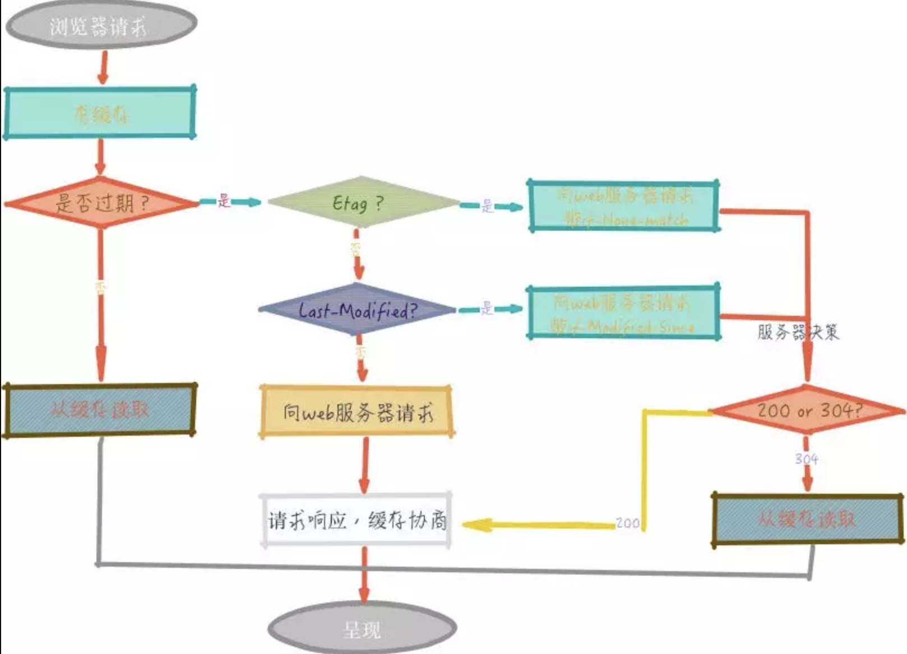

### 雅虎军规

1. 尽量减少 HTTP 请求个数——须权衡
2. 使用 **CDN**（内容分发网络）
3. 为文件头指定 Expires 或 Cache-Control ，使内容具有缓存性。
4. 避免空的 src 和 href
5. 使用 gzip 压缩内容
6. 把 CSS 放到顶部
7. 把 JS 放到底部
8. 避免使用 CSS 表达式
9. 将 CSS 和 JS 放到外部文件中
10. 减少 DNS 查找次数
11. 精简 CSS 和 JS
12. 避免跳转
13. 剔除重复的 JS 和 CSS
14. 配置 ETags
15. 使 AJAX 可缓存
16. 尽早刷新输出缓冲
17. 使用 GET 来完成 AJAX 请求
18. 延迟加载
19. 预加载
20. 减少 DOM 元素个数
21. 根据域名划分页面内容
22. 尽量减少 iframe 的个数
23. 避免 404
24. 减少 Cookie 的大小
25. 使用无 cookie 的域
26. 减少 DOM 访问
27. 开发智能事件处理程序
28. 用link 代替 @import
29. 避免使用滤镜
30. 优化图像
31. 优化 CSS Spirite
32. 不要在 HTML 中缩放图像——须权衡
33. favicon.ico要小而且可缓存
34. 保持单个内容小于25K
35. 打包组件成复合文本


### js处理方式

##### 减少http请求

​	80%的终端用户响应时间都花在了前端上，其中大部分时间都在下载页面上的各种组件：图片，样式表，脚本，Flash等等。减少请求网络时间的方法： 减少网络请求次数、减少文件体积、使用CDN加速。

​	 用gulp 、 webpack、grunt 等构建工具压缩、合并 js和css。

​	css Sprites  减少图片请求数量。把背景图片都整合到一张图片中，然后用CSS的`background-image`和`background-position`属性来定位要显示的部分。 

​	图像映射 可以把多张图片合并成单张图片，总大小是一样的，但减少了请求数并加速了页面加载。图片映射只有在图像在页面中连续的时候才有用，比如导航条。给image map设置坐标的过程既无聊又容易出错，用image map来做导航也不容易，所以不推荐用这种方式。

　　行内图片（Base64编码）用[data: URL模式来把图片嵌入页面。这样会增加HTML文件的大小，把行内图片放在（缓存的）样式表中是个好办法，而且成功避免了页面变“重”。但目前主流浏览器并不能很好地支持行内图片。

　　减少页面的HTTP请求数是个起点，这是提升站点首次访问速度的重要指导原则。

​	缓存会根据请求保存输出内容的副本，例如 页面、图片、文件，当下一个请求来到的时候:如果是相同的 URL，缓存直接使 用本地的副本响应访问请求，而不是向源服务器再次发送请求。因此，可以从以下 2 个方面提升性能：减少相应延迟，提升响应时间；减少网络带宽消耗，节省流量。

​	 **缓存机制**

​	浏览器第一次请求

```flow
st=>start: 浏览器请求
opA=>operation: 无缓存
opB=>operation: 向web服务器请求
opC=>operation: 请求反应，缓存协商
e=>end: 呈现

st->opA->opB->opC->e
```
​	浏览器再次请求

 



##### 让Ajax可缓存

​	例子：一个Web 2.0的电子邮件客户端用了Ajax来下载用户的通讯录，以便实现自动完成功能。如果用户从上一次使用之后再没有修改过她的通讯录，而且Ajax响应是可缓存的，有尚未过期的Expires或者Cache-Control HTTP头，那么之前的通讯录就可以从缓存中读出。必须通知浏览器，应该继续使用之前缓存的通讯录响应，还是去请求一个新的。可以通过给通讯录的Ajax URL里添加一个表明用户通讯录最后修改时间的时间戳来实现，例如`&t=1190241612`。如果通讯录从上一次下载之后再没有被修改过，时间戳不变，通讯录就将从浏览器缓存中直接读出，从而避免一次额外的HTTP往返消耗。如果用户已经修改了通讯录，时间戳也可以确保新的URL不会匹配缓存的响应，浏览器将请求新的通讯录条目。 

### 图片处理

##### 常用图片处理

​	图片精灵、图片懒加载、图片压缩（tinypng）

##### 不要用HTML缩放图片

​	不要因为在HTML中可以设置宽高而使用本不需要的大图。如果需要

```html

```

　　那么图片本身（mycat.jpg）应该是100x100px的，而不是去缩小500x500px的图片。

##### 用小的可缓存的favicon.ico（P.S. 收藏夹图标）

​	favicon.ico是放在服务器根目录的图片，它会带来一堆麻烦，因为即便你不管它，浏览器也会自动请求它，所以最好不要给一个`404 Not Found`响应。而且只要在同一个服务器上，每次请求它时都会发送cookie，此外这个图片还会干扰下载顺序，例如在IE中，当你在onload中请求额外组件时，将会先下载favicon。

所以为了缓解favicon.ico的缺点，应该确保：

- 足够小，最好在1K以下
- 设置合适的有效期HTTP头（以后如果想换的话就不能重命名了），把有效期设置为几个月后一般比较安全，可以通过检查当前favicon.ico的最后修改日期来确保变更能让浏览器知道。

### css

##### 避免使用滤镜

​	　IE专有的`AlphaImageLoader`滤镜可以用来修复IE7之前的版本中半透明PNG图片的问题。在图片加载过程中，这个滤镜会阻塞渲染，卡住浏览器，还会增加内存消耗而且是被应用到每个元素的，而不是每个图片，所以会存在一大堆问题。

最好的方法是干脆不要用`AlphaImageLoader`，而优雅地降级到用在IE中支持性很好的PNG8图片来代替。如果非要用`AlphaImageLoader`，应该用下划线hack：`_filter`来避免影响IE7及更高版本的用户。

 

### 其它

##### 减少dns查找

​	域名系统建立了主机名和IP地址间的映射，就像电话簿上人名和号码的映射一样。当你在浏览器输入www.yahoo.com的时候，浏览器就会联系DNS解析器返回服务器的IP地址。DNS是有成本的，它需要20到120毫秒去查找给定主机名的IP地址。在DNS查找完成之前，浏览器无法从主机名下载任何东西。

　　DNS查找被缓存起来更高效，由用户的ISP（网络服务提供商）或者本地网络存在一个特殊的缓存服务器上，但还可以缓存在个人用户的计算机上。DNS信息被保存在操作系统的DNS cache(微软Windows上的”DNS客户端服务”)里。大多数浏览器有独立于操作系统的自己的cache。只要浏览器在自己的cache里还保留着这条记录，它就不会向操作系统查询DNS。

##### 避免重定向

​	牢记重定向会拖慢用户体验，在用户和HTML文档之间插入重定向会延迟页面上的所有东西，页面无法渲染，组件也无法开始下载，直到HTML文档被送达浏览器。

　　有一种常见的极其浪费资源的重定向，而且web开发人员一般都意识不到这一点，就是URL尾部缺少一个斜线的时候。例如，跳转到<http://astrology.yahoo.com/astrology>会返回一个重定向到<http://astrology.yahoo.com/astrology/>的301响应（注意添在尾部的斜线）。在Apache中可以用`Alias`，`mod_rewrite`或者`DirectorySlash`指令来取消不必要的重定向。

##### 预加载组件

​	预加载可能看起来和延迟加载是相反的，但它其实有不同的目标。通过预加载组件可以充分利用浏览器空闲的时间来请求将来会用到的组件（图片，样式和脚本）。用户访问下一页的时候，大部分组件都已经在缓存里了，所以在用户看来页面会加载得更快。

实际应用中有以下几种预加载的类型：

- 无条件预加载——尽快开始加载，获取一些额外的组件。google.com就是一个sprite图片预加载的好例子，这个sprite图片并不是google.com主页需要的，而是搜索结果页面上的内容。
- 条件性预加载——根据用户操作猜测用户将要跳转到哪里并据此预加载。在[search.yahoo.com](http://search.yahoo.com/)的输入框里键入内容后，可以看到那些额外组件是怎样请求加载的。
- 提前预加载——在推出新设计之前预加载。经常在重新设计之后会听到：“这个新网站不错，但比以前更慢了”，一部分原因是用户访问先前的页面都是有旧缓存的，但新的却是一种空缓存状态下的体验。可以通过在将要推出新设计之前预加载一些组件来减轻这种负面影响，老站可以利用浏览器空闲的时间来请求那些新站需要的图片和脚本。

##### 减少DOM元素的数量

​	一个复杂的页面意味着要下载更多的字节，而且用JavaScript访问DOM也会更慢。 

##### 跨域分离组件

​	分离组件可以最大化并行下载，但要确保只用不超过2-4个域，因为存在DNS查找的代价。例如，可以把HTML和动态内容部署在`www.example.org`，而把静态组件分离到`static1.example.org`和`static2.example.org`。 

##### 尽量少用iframe

用iframe可以把一个HTML文档插入到父文档里，重要的是明白iframe是如何工作的并高效地使用它。

iframe的优点：

- 引入缓慢的第三方内容，比如标志和广告
- 安全沙箱
- 并行下载脚本

iframe的缺点：

- 代价高昂，即使是空白的iframe
- 阻塞页面加载
- 非语义

##### 杜绝404

​	HTTP请求代价高昂，完全没有必要用一个HTTP请求去获取一个无用的响应（比如404 Not Found），只会拖慢用户体验而没有任何好处。

　　有些站点用的是有帮助的404——“你的意思是xxx？”，这样做有利于用户体验，，但也浪费了服务器资源（比如数据库等等）。最糟糕的是链接到的外部JavaScript有错误而且结果是404。首先，这种下载将阻塞并行下载。其次，浏览器会试图解析404响应体，因为它是JavaScript代码，需要找出其中可用的部分。


##### 参考文档

https://mp.weixin.qq.com/s/m1dwFaOcUBEhoPgcR50xdw

https://www.cnblogs.com/xianyulaodi/p/5755079.html