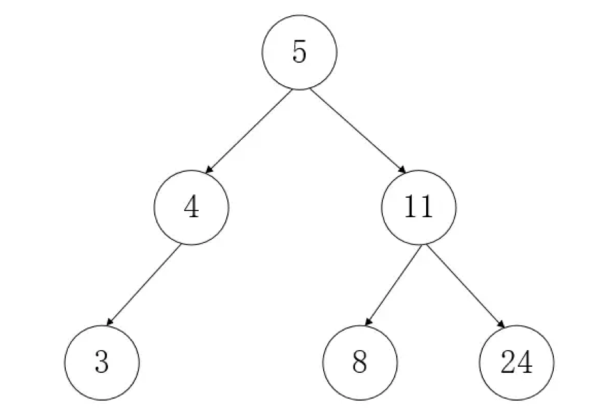

### 实现二叉查找树



##### 树相关术语：

- 节点：树中的每个元素称为一个节点。
- 根节点：位于整棵树顶点的节点，它没有父节点， 如上图 5。
- 子节点：其他节点的后代。
- 叶子节点：没有子节点的元素称为叶子节点， 如上图 3、8、24。
- 二叉树：二叉树就是一种数据结构， 它的组织关系就像是自然界中的树一样。官方语言的定义是：是一个有限元素的集合,该集合或者为空、或者由一个称为根的元素及两个不相交的、被分别称为左子树和右子树的二叉树组成。
- 二叉查找树：二叉查找树也叫二叉搜索树（BST），它只允许我们在左节点存储比父节点更小的值，右节点存储比父节点更大的值，上图展示的就是一颗二叉查找树。

##### 二叉树遍历

二叉树的遍历分为三类：前序遍历、中序遍历和后序遍历。 

- 前序遍历（先序遍历）：  先访问根节点，再遍历左子树，最后遍历右子树；并且在遍历左右子树时，仍需先访问根节点，然后遍历左子树，最后遍历右子树。上图的前序遍历如下。 


- 中序遍历： 先遍历左子树、然后访问根节点，最后遍历右子树；并且在遍历左右子树的时候。仍然是先遍历左子树，然后访问根节点，最后遍历右子树。前图的中序遍历如下。 


- 后续遍历：先遍历左子树，然后遍历右子树，最后访问根节点；同样，在遍历左右子树的时候同样要先遍历左子树，然后遍历右子树，最后访问根节点。前图后序遍历结果如下。 

  


##### 包含方法

- insert(key) 插入一个新的键
- inOrderTraverse() 对树进行中序遍历，并打印结果
- preOrderTraverse() 对树进行先序遍历，并打印结果
- postOrderTraverse() 对树进行后序遍历，并打印结果
- search(key) 查找树中的键，如果存在返回true,不存在返回fasle
- findMin() 返回树中的最小值
- findMax() 返回树中的最大值
- remove(key) 删除树中的某个键

##### 代码实现

```javascript
// 二差查找树
function BinarySearchTree() {
	function Node(key) {
		this.key = key
		this.left = null
		this.right = null
	}

	let root = null

	// 插入新节点
	this.insert  = (key) => {
		let newNode  = new Node(key)
		if (root === null) {
			root = newNode
		} else {
			insertNode(root, newNode)
		}
	}

	const insertNode = (node, newNode) => {
		if (newNode.key <= node.key) {
			if (node.left === null) {
				node.left = newNode
			} else {
				insertNode(node.left, newNode)
			}
		} else {
			if (node.right === null) {
				node.right = newNode
			} else {
				insertNode(node.right, newNode)
			}
		}
	}

	// 中序遍历
	this.inOrderTraverse = () => {
		inOrderTraverseNode(root)
	} 

	const inOrderTraverseNode = (node) => {
		if (node !== null) {
			inOrderTraverseNode(node.left)
			console.log(node.key)
			inOrderTraverseNode(node.right)
		}
	}

	// 先序遍历
	this.preOrderTraverse  = () => {
		preOrderTraverseNode(root)
	}
	

	const preOrderTraverseNode = (node) => {
		console.log(node.key)
		preOrderTraverseNode(node.left)
		preOrderTraverseNode(node.right)
	}

	// 后序遍历
	this.postOrderTraverse = () => {
		postOrderTraverseNode(root)
	}

	const postOrderTraverseNode = (node) => {
		postOrderTraverseNode(node.left)
		postOrderTraverseNode(node.right)
		console.log(node.key)
	}
    
    // 查找最小值
	this.findMin = () => {
		return minNode(root)
	}
	const minNode = (node) => {
		if (node) {
			while (node && node.left !== null) {
				node = node.left
			}
			return node.key
		}
		return null
	} 

	// 查找最大值
	this.findMax = () => {
		return maxNode(root)
	}
	const maxNdoe = (node) => {
		if (node) {
			while (node && node.right !== null) {
				node = node.right
			}
			return node.key
		}
		return null
	}

	// 搜索特定值
	this.search = (key) => {
		return searchNode(root, key)
	} 
	const searchNode = (node, key) => {
		if (node === null) {
			return false
		} else if(key < node.key) {
			searchNode(node.left, key)
		} else if(key > node.key) {
			searchNode(node.right, key)
		} else {
			return true
		}
	}
}
```

```javascript
// 调用
let arr = [9,6,3,8,12,15]
let tree = new BinarySearchTree()
arr.map((item) => {
    tree.insert(item)
})
tree.inOrderTraverse
tree.preOrderTraverse
tree.postOrderTraverse
```

##### 移除节点 

移除节点的实现情况比较复杂，它会有三种不同的情况： 

- 需要移除的节点是一个叶子节点
- 需要移除的节点包含一个子节点
- 需要移除的节点包含两个子节点

如果是节点包含两个子节点，比较复杂，因为删除后顺序要不乱：

这种类型的节点要删除，如果直接删，真个树的大小顺序就乱了，所以需要考虑，在树中找到一个合适的节点来把这个节点 给替换掉，用这种方法来保持整个数的稳定。所以又一个问题又来了了，该找哪个节点来替换它？结论是，需要在树中找出所有比被删除节点的值大的所有数，并在这些数中找出一个最小的数来。听起来很拗，如果把它用图形来描述的话，就是，从被删除的节点出发 经过它的右节点，然后右节点最左边的叶子节点就是我们要找的，它有一个专业名词叫**中序后继节点 **。 


```javascript
// 移除节点
	this.remove = (key) =>  {
		removeNode(root, key)
	}
	const removeNode = (node, key) => {
		if (node !== null) {
			return null
		}
		if (key < node.key) {
			node.left = removeNode(node.left, key)
			return node
		} else if (key > node.key) {
			node.right = removeNode(node.right, key)
			return node
		} else {
			// 需要移除的节点是一个叶子节点
			if (node.left === null && node.right === null) {
				node = null
				return node
			} 

			// 需要移除的节点包含一个子节点
			if (node.left === null) {
				node = node.left
				return node
			} else if (node.right === null) {
				node = node.right
				return node
			}

			// 需要移除的节点包含两个子节点
			let aux = findNode(node.right)
			node.key = aux.key
			node.right = removeNode(node.right, aux.key)
			return node
		}
	}

	const findMinNode = (node) => {
		if (node) {
			while (node && node.left !== null) {
				node = node.left
			}
			return node
		}
		return null
	} 
```

